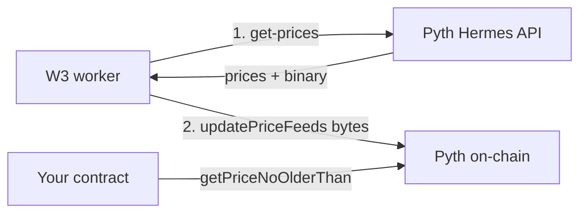

# Off-chain Trigger, On-chain Price Guard

A pattern for using Pyth Network as both the off-chain price source
that drives your decision and the on-chain price source that enforces
the band when the transaction lands.

> **The mental model: client / server validation, but for trades.**
> Your worker is the client. Cheap, fast, off-chain checks tell it
> what's possible. The contract on Avalanche is the server.
> Authoritative checks refuse to commit if reality drifted between
> the decision and the transaction.
>
> This isn't Pyth's marketing language. It's _our_ way of teaching
> you how to think about their architecture. The two endpoints they
> give you slot into this shape naturally.

## Why this pattern matters

Most oracle integrations make the off-chain price read and the
on-chain price read look like two different systems:

- The off-chain read comes from a vendor API (or sometimes a node
  RPC) and you trust it because it's convenient.
- The on-chain read comes from whatever the contract reads — often
  a "push" feed that someone else paid to keep fresh, which may not
  reflect the price _your worker_ saw.

When these two prices disagree, the contract executes on whatever
the on-chain feed happens to say at landing time. A frontrunner can
move the market between your decision and your transaction, and
your contract has no way to notice.

Pyth's design closes this gap. Hermes (off-chain) returns both a
human-readable price AND a signed binary blob. Submit that blob to
Pyth's on-chain contract via `updatePriceFeeds(bytes[])`, and any
contract on the same chain can now `getPriceNoOlderThan(...)` and
read the _same observation your worker used to decide_. If reality
drifted, the contract refuses.

## The recipe

Two steps. Single workflow. Same workflow run, same price
observation, both sides of the wire.



### Step 1 — off-chain (Hermes API)

```yaml
- name: Snapshot prices via Pyth Hermes
  id: prices
  uses: w3-io/w3-pyth-action@main
  with:
    command: get-prices
    symbols: BTC,ETH,XAU,AAPL
```

The `get-prices` output ships two parts: the parsed `prices[]` array
your worker uses to decide, and the `binary` blob you forward
on-chain. Multi-asset in one call: Pyth covers crypto, equities, FX,
metals, etc.

Use the **confidence band** on each price as part of your decision.
A wider band means more uncertainty — refuse to act if the band is
wider than the strategy can tolerate.

### Step 2 — on-chain (Pyth Pull Oracle)

```yaml
- name: Commit observation on-chain
  id: pyth_commit
  ethereum:
    network: avalanche
    signer: '${{ secrets.PYTH_COOKBOOK_SIGNING_KEY }}'
    write:
      call-contract:
        contract: '0x4305FB66699C3B2702D4d05CF36551390A4c69C6'
        method: 'updatePriceFeeds(bytes[])'
        args:
          - '${{ fromJSON(steps.prices.outputs.result).binary.data }}'
        value: '10000'
        rpcUrl: '${{ secrets.AVALANCHE_RPC_URL }}'
```

This forwards Hermes's binary blob to Pyth's contract on Avalanche
mainnet. The contract verifies the Wormhole signature on the blob
and stores the price. Any contract on Avalanche can now read it via
`Pyth.getPriceNoOlderThan(feedId, maxAgeSec)`.

A production rebalancer would extend this step into a single atomic
transaction:

```text
update Pyth → read price → check band → execute swap
```

So that if the price drifted between the worker's decision and the
transaction landing, the band check reverts and no swap happens.

## What to remember

- **One price observation, two consumers.** Off-chain decision and
  on-chain enforcement share the binary blob.
- **Pyth's confidence band is part of the contract.** Use it
  off-chain to decide; use it on-chain to enforce.
- **The pattern is composable.** Step 2 here is just the price
  update. Compose it inside your own contract for atomic
  read-and-check-and-execute.
- **Vendor-neutral on swap layer.** The recipe stops at the price
  commit so the swap layer (CoW Swap, 1inch, direct DEX, etc.)
  stays your choice.

## Try it

```bash
# Provision a namespace, the secrets, and the workflow definition.
# (See w3-solutions/solutions/private-wealth/scripts/provision.sh for
# a reference layout.)

w3 trigger Pyth\ —\ Off-chain\ Trigger,\ On-chain\ Price\ Guard
```

After the run lands you'll see two cards on the W3 Explorer Overview
tab — the Hermes snapshot and the on-chain commit. The on-chain
commit card links to the Avalanche transaction so you can verify
the price update arrived.
